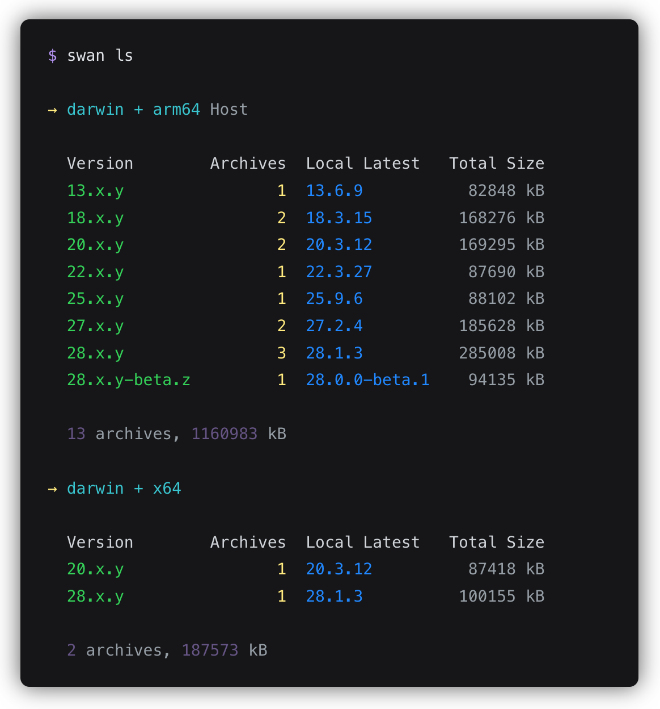
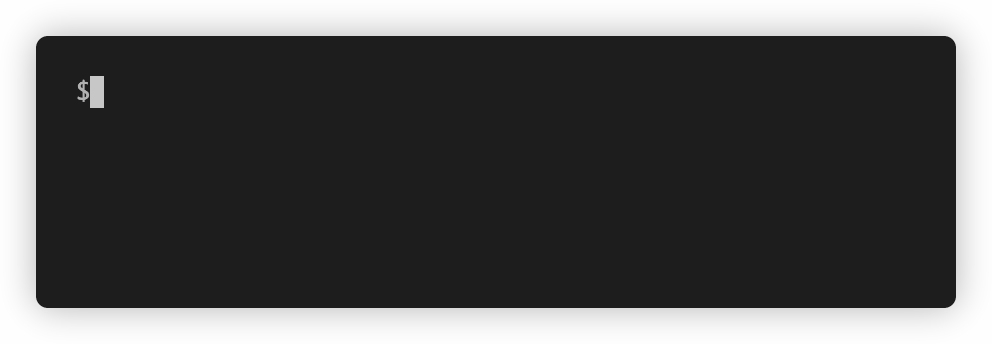
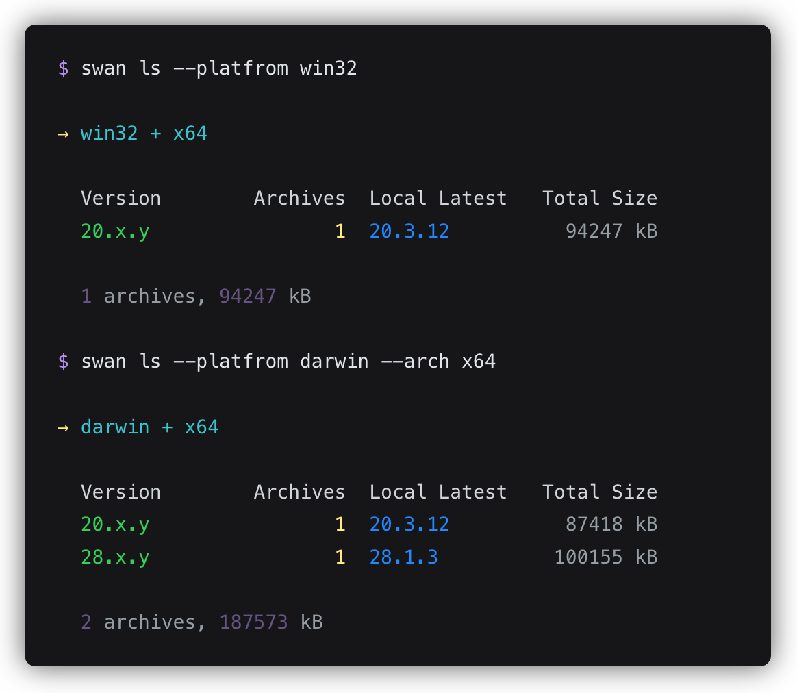
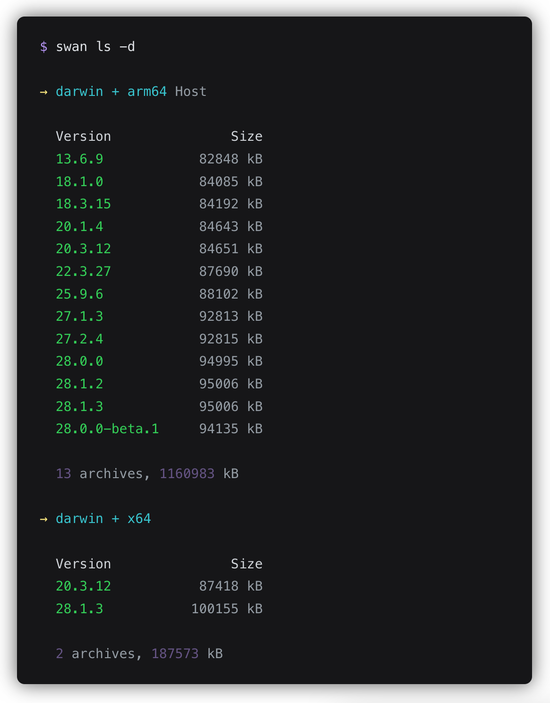
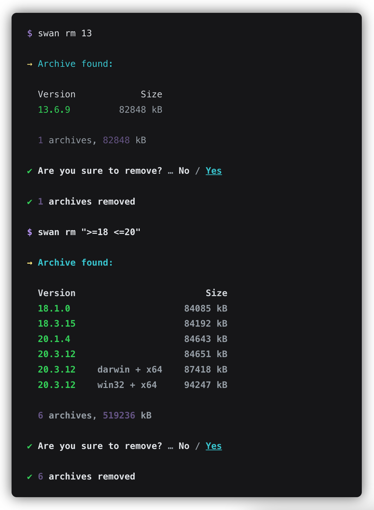
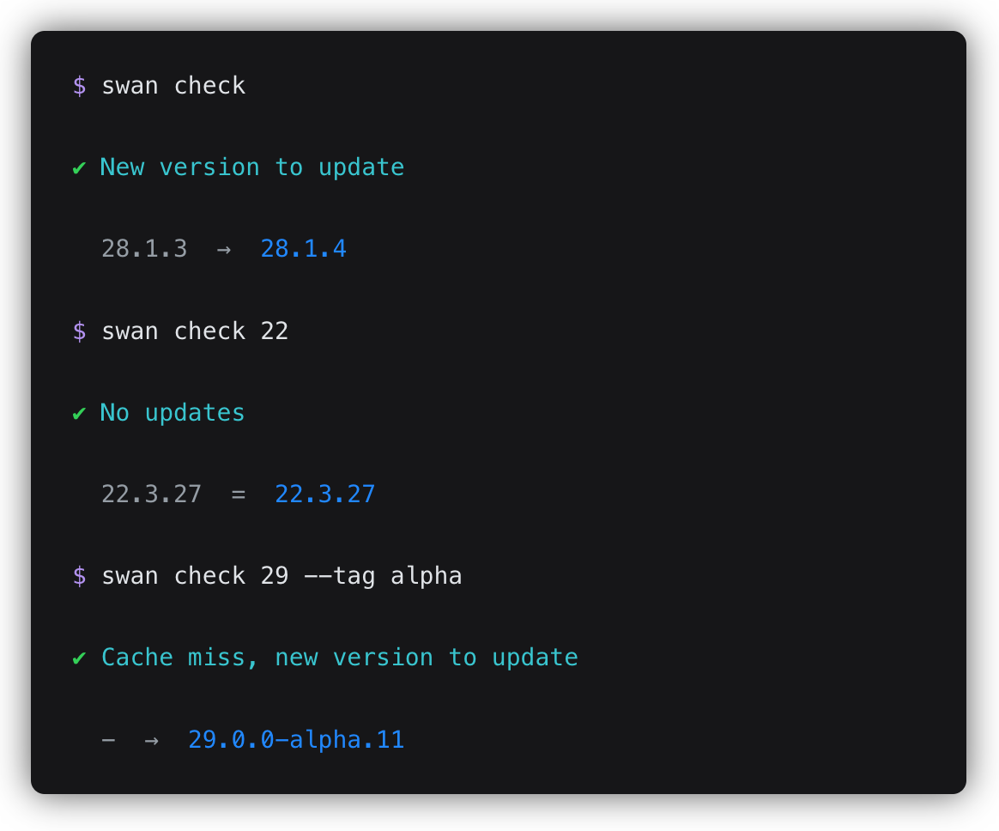

<h1 align="center">🦢 electron-swan</h1>

A cli tool for managing local Electron release artifacts

<pre align="center">npm i -g <b>electron-swan</b></pre>

use <b>swan</b> to download and cache before installing or updating Electron

## Features

- List all local artifacts and disk usage
- Clean up by version range to save disk space
- Check for updates by version range
- Make Electron installation faster

## Usage

See `swan --help` for more details

### swan list

Aliases: `swan ls`.

List all local artifacts.

| Options          | Description                                       |
| ---------------- | :------------------------------------------------ |
| `-p, --platfrom` | specify platform, e.g. `darwin`, `win32`, `linux` |
| `-a, --arch`     | specify architecture, e.g. `x64`, `ia32`, `arm64` |
| `-d, --detail`   | show all archives (default: false)                |

Specify <b>arch</b> or <b>platform</b>

Show all archives

## swan remove \<version\>

Aliases: `swan rm <version>`.

Clean up local artifacts by version range. The `version` is required and is satisfied by the version range according to [semver](https://github.com/npm/node-semver).

You can use `-f, --force` option to remove directly without confirmation.

## swan check [version]

Check for updates by version prefix. You can use `--tag` option to check prerelease version, the tag must be `beta` or `alpha`.

## swan install [version]

Aliases: `swan i`, `swan add`.

Download the newer version that is satisfied by the version range according to semver. If no version range is specified, the latest version will be downloaded.

| Options          | Description                                                                  |
| ---------------- | :--------------------------------------------------------------------------- |
| `-p, --platfrom` | specify platform, e.g. `darwin`, `win32`, `linux`                            |
| `-a, --arch`     | specify architecture, e.g. `x64`, `ia32`, `arm64`                            |
| `--mirror`       | specify mirrors to download Electron release artifacts (default: npm mirror) |

## License

[MIT](./LICENSE) © alex.wei
